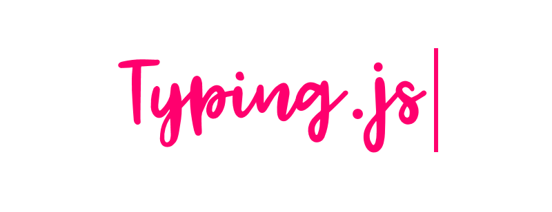

Typing.js is a **library** which allows you to create a typing effect on your web page within seconds. You can **change lines**, **backspace** words, and put the typing on **hold** on .Wanna see watch it [here](https://nishutosh.github.io/typing.js)

now lets see


### How to see it dancing on you page

Just add these line to your html file

```html
<script src="typing.js"></script>
<script>
    var typing=Typing("hello how are you.")
    typing();
</script>

```
and place the below html tags where you want your cursor effect.

```html
<span id="text"></span>
<span id="blinker">|</span>

```


its done,you may style the blinker and text as you want

now lets look how to  add effects

#### How to create effects
---
Parameters you can pass:

```javascript

    var typing=Typing("hello how are you.",type_speed,blink_speed,backspace_speed,mainspanid,blinkerid)
    typing();


```

lets look at thes Parameters
1. **type_speed**: Typing speed in milliseconds. (default **100**).
2. **blink_speed**: Cursor blink speed in milliseconds. (default **300**)
3. **backspace_speed**: Cursor  speed in milliseconds while backspacing words. (default **100**)
